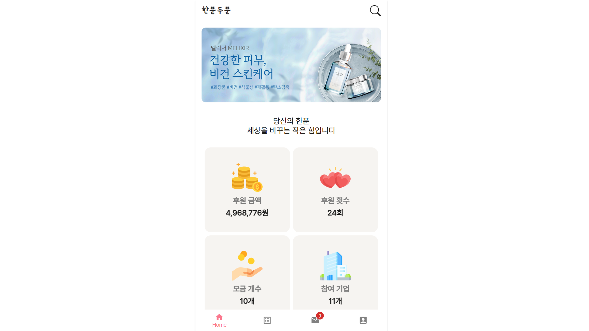
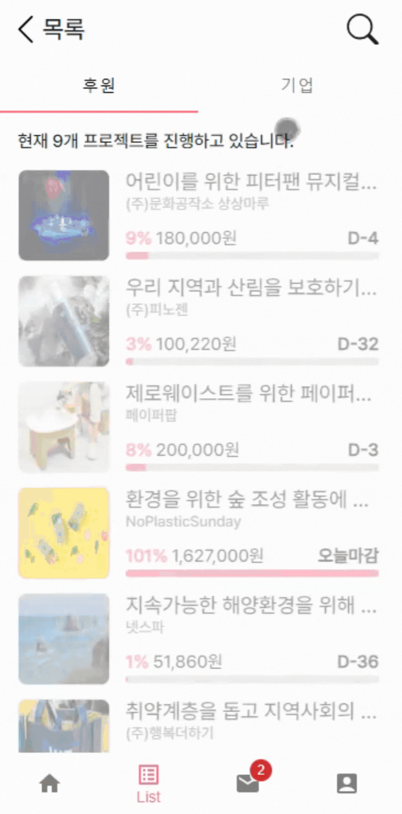
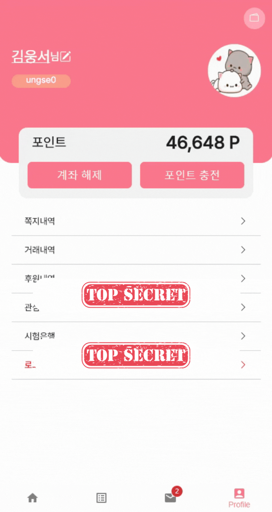
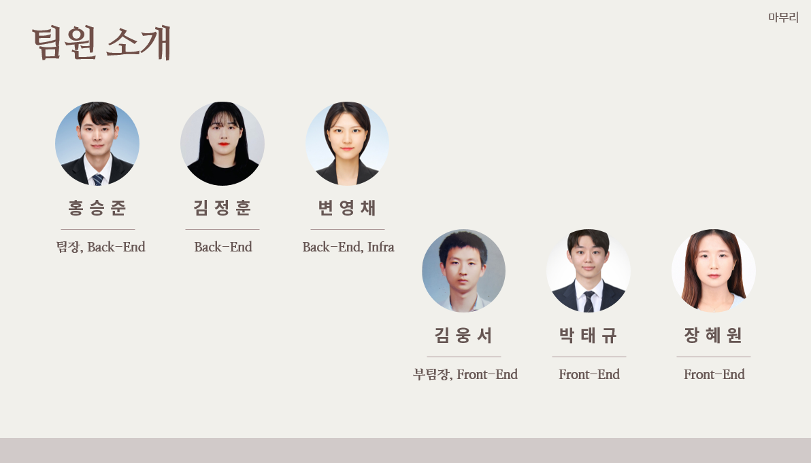

# 💰한푼두푼(HPDP) 💰

프로젝트 기간: 2023.08.21 ~ 2023.10.06

---

## 서비스 소개

---

**일상에서 생기는 잔돈으로 소셜벤처에 후원해주세요!** ❤ **[UCC보러가기](https://youtu.be/pNRrlDQ1Il0)** ❤

한푼두푼(HPDP)은 크라우드 펀딩을 활용한 소셜 벤처 자금 후원 서비스 플랫폼입니다.

일상에서 발생하는 끝전으로 당신이 관심을 가지는 기업과 프로젝트에 후원하세요.

<!--  -->


## 서비스 특징

---

1. 끝전을 활용한 소셜 벤처 크라우드 펀딩 플랫폼

2. 매일 10시, 당신의 잔돈(1000원 이하)이 포인트로 쌓입니다.

3. 쌓인 포인트로 원하는 프로젝트를 후원하세요!

4. 한푼두푼만의 블록체인 코인으로 후원금액이 전달되는 과정을 투명하게 관리합니다.

## 주요 기능

---

#### 끝전 자동이체

- 자체 뱅킹 서비스를 구현하여 매일 오후 10시 끝전 자동이체 기능을 제공합니다.

- 끝전으로 인한 후원의 심리적 장벽을 낮추고 부담없이 포인트를 모을 수 있도록 사용자의 참여를 유도합니다.

#### 스마트 컨트랙트와 블록체인을 이용한 한푼두푼 코인

- 스마트 컨트랙트를 이용하여 크라우드 펀딩 로직을 구현했습니다.

- 프라이빗 네트워크를 구축하여 HPDP만의 토큰을 발행하여 원화와 토큰의 1:1 환전을 가능하게해 가격 변동성을 제거하였습니다.

#### OpenAI를 이용한 기업 정보제공

- OpenAI(ChatGPT)를 활용해 소셜벤처에 대한 요약 정보를 제공합니다.

- 후원자에게는 해당 기업에 대한 정보와 후원에 대한 신뢰를, 소셜벤처에게는 기업에 대한 정보를 전달하고 홍보효과를 줄 수 있습니다.

## 기능별 화면

### 계좌 등록


### 관심기업



### 끝전 알림


<!-- ### 토스

 -->

### 알림 확인


### 기업 리스트 조회


### 기업 쪽지 보내


### 후원하기


### 후원내역 확인


### 후원리스트


### 블록체인 확인


### 기업 정산


---

## 사용한 외부 서비스

---

- OpenAI(ChatGPT)

- Web3 API

## 시스템 아키텍쳐

---

<!--  -->


## ERD 다이어그램

---

<!--  -->


## 문서 링크

---

- [팀노션]([Notion – The all-in-one workspace for your notes, tasks, wikis, and databases.](https://nonstop-basil-8e5.notion.site/fintech-d8bbd29d3ca24a36aef3a09bdabd5e28))

- [API명세서](https://nonstop-basil-8e5.notion.site/API-dc66a4b230534c7c8091f42aa53ec28f)

- [기능명세서](https://nonstop-basil-8e5.notion.site/986107c1b0e146edaa73ebf37f1298be)

## Git-flow

---

- 기능 개발이 완료되면 feature branch를 develop branch로 merge한다.

- branch 규칙

> master : 운영 서버로 배포하기 위한 branch
> develop : 다음 출시 기능을 개발하는 branch
> 
> BC: blockchain branch
> BE: backend branch
> FE: frontend branch
> feature : 세부 기능을 개발하는 branch, branch 이름은 각 기능명으로 작성

- feature branch 이름 규칙

> feature/[FE/BE/BC]/[기능명]
> ex) feature/BE/member
> ex) feature/FE/webrtc

## commit conventions

```javascript
[커밋타입] - 작업내용_한눈에_알아보게_적기_최대한_자세하게
ex)[INIT](띄어쓰기) 초기화
- INIT: 초기화 (이건 쓸일 거의 없어여 -> 맨처음에 ㄱㄱ)
- FEAT: 새로운 기능을 추가할 경우
- MODIFY: 코드를 수정한 경우
- DESIGN or STYLE: 기능에 영향을 주지 않는 커밋, 코드 순서, CSS등의 포맷에 관한 커밋
- FIX: 버그를 고친 경우
- REFACTOR: 프로덕션 코드 리팩토링
- TEST: 테스트 코드 작성
- DOCS: main 문서를 수정한 경우, readme, log 등
- REVIEW: 코드 리뷰 반영
- BUILD: 빌드 변경
- BACKUP: 백업
- COMMENT : 주석
- FILE: 파일 삭제, 추가, 수정을 수행하는 경우
- MERGE: 충돌 시 머지, develop 브랜치에 풀리퀘 등
- CHORE: 위에 해당되지 않는 나머지 (기타 등등)
```

## JIRA 규칙

---

```javascript
기준

- epic : 스토리들의 집합체, 스프린트가 필요한 작업 내용을 정의
    - 회원 관리
- story : 에픽의 Use Case, 사용자가 수행하는 행동과 목표 위주 기술
    - 회원 가입, 로그인
- task : 스토리에서 기술한 내용을 달성하기 위해 수행해야할 기술적인 업무
    - 회원 가입, 아이디 중복체크

[날짜] 이름 

- 이슈 연결하기
- 컴포넌트 선택 [ BE | FE ]
```

## 폴더 구조

---

```
frontend
  ├── docker
  ├── assets
  ├── node_modules
  ├── public
  └── src
      ├── api
      ├── components
      ├── interface
      ├── pages
      ├── store
      ├── style
      │   ├─ css
      │   ├─ fonts
      │   └─ scss
      └── types
```

```
backend
└─ main
  ├─ config
  ├─ controller
  │  └─ member
  │     ├─ request 
  │     |    └─ MemberReq
  |     └─ response
  │          └─ MemberRes
  ├─ service
  │  └─ member
  │     └─ MemberService
  │     └─ MemberQueryService 
  │        # @ReadOnly 조회때 사용
  ├─ common # dao
  │  ├─ auth
  │  ├─ exception
  │  └─ util
  └─ model
     ├─ entity
     |  └─ Member
     └─ repository
        ├─ MemberRepository
        └─ MemberQueryRepository
```

## 팀원 소개

---



## 맡은 역할
|   이름   |    역할     | 설명                                                      |
|------|---------|--------------------------------------------------------|
| 홍승준 |   백엔드, 블록체인 담당   | geth를 이용한 private network 구축, 솔리디티 크라우드 펀딩 스마트컨트랙트 구현, web3j를 이용하여 spring boot와 private network 통신, 포인트 API                               |
| 김정훈 |   백엔드 담당   | Redis를 활용한 즐겨찾기 기능,  SSE를 이용한 알림 구현, Spring Security + Jwt + Redis 로그인 구현, 예외 처리(Customized Exception Handler) 설계, Fast API(뉴스 크롤링, openAI)                               |
| 변영채 |   백엔드, 인프라 담당   | 펀딩 관련 CRUD API 구현, 자체 뱅킹 서비스 구현(테스트 은행), 쪽지 API 구현, 기업 마이페이지 API 구현, EC2, Nginx, Docker-Compose를 이용한 배포, S3 연동                               |
| 김웅서 | 프론트엔드 | 클라이언트 사이드 개발 초기 환경 설정, 공통 컴포넌트 개발, 토스페이먼츠 API를 이용한 결제 기능 구현, Auth 관련 기능(회원가입, 로그인) 구현, CSS 애니메이션 구현 |
| 박태규 | 프론트엔드, 블록체인 담당 | Geth를 이용한 Private Networks 구축, Web3 API를 활용한 클라이언트와 블록체인 네트워크의 통신, 자체 뱅킹 시스템 구현, SSE API를 이용한 알림 구현 |
---
